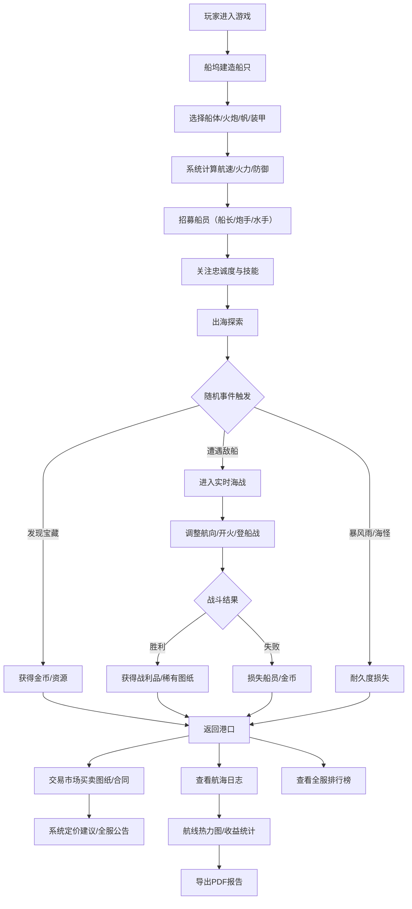

## 1. 产品概述

多人在线海盗船经营与海上掠夺系统，玩家可建造定制化海盗船、招募特色船员、出海探索与战斗、交易资源，并通过每周航海日志记录冒险历程。
- 目标用户：喜欢策略经营类游戏、航海题材爱好者、多人在线社交玩家
- 产品价值：提供沉浸式海盗世界体验，结合经营策略、实时战斗与社交交易玩法

## 2. 核心功能

### 2.1 用户角色
| 角色 | 注册方式 | 核心权限 |
|------|----------|----------|
| 海盗船长（玩家） | 昵称创建 | 建造船只、招募船员、出海探索、发起海战、市场交易、查看排行榜 |

### 2.2 功能模块
1. **船坞页面**：船体选择、火炮配置、帆与装甲装备、属性实时计算
2. **船员页面**：船长/炮手/水手招募、忠诚度管理、技能展示
3. **航海页面**：航线地图、天气系统、随机事件、探索按钮
4. **海战页面**：实时战斗界面、船只状态、火炮控制、登船战、战利品结算
5. **交易市场**：图纸买卖、船员合同、定价建议、全服公告
6. **航海日志**：航线热力图、收益统计、士气变化、PDF导出
7. **排行榜**：财富榜、战力榜、掠夺榜

### 2.3 页面详情
| 页面名称 | 模块名称 | 功能描述 |
|----------|----------|----------|
| 船坞 | 模块选择器 | 船体/火炮/帆/装甲分类选择 |
| 船坞 | 属性面板 | 实时计算并展示航速、火力、防御值 |
| 船坞 | 3D预览区 | 船只外观动态展示 |
| 船员 | 招募列表 | 可招募船员卡片，含忠诚度和技能 |
| 船员 | 船员管理 | 解雇、查看详情、忠诚度趋势图 |
| 航海 | 航线地图 | SVG海上地图，显示当前位置和目标 |
| 航海 | 天气面板 | 实时天气（晴/雨/暴风雨）、风速风向 |
| 航海 | 事件通知 | 随机事件弹出（宝藏、敌船、海怪、暴风雨） |
| 海战 | 战斗画布 | 双方船只实时移动、弹道轨迹 |
| 海战 | 状态面板 | 双方耐久度、火炮冷却、船员伤亡 |
| 海战 | 操作面板 | 航向调整、开火、登船战按钮 |
| 海战 | 结算弹窗 | 战利品展示、稀有图纸获得动画 |
| 交易市场 | 分类浏览 | 图纸/船员合同分类、筛选排序 |
| 交易市场 | 定价弹窗 | 近7天均价、建议价格区间、卖家自定义定价 |
| 交易市场 | 全服公告条 | 滚动展示成交信息和赏金猎人事件 |
| 航海日志 | 时间轴 | 本周冒险事件时间线 |
| 航海日志 | 热力图 | 航线频率热力图（SVG） |
| 航海日志 | 统计图表 | 收益柱状图、士气折线图、战斗雷达图 |
| 航海日志 | 导出按钮 | 生成含战斗统计的PDF报告 |
| 排行榜 | 排名列表 | 三个子榜单切换（财富/战力/掠夺） |
| 排行榜 | 玩家卡片 | 前三名详细展示，含头像和成就徽章 |

## 3. 核心流程

玩家进入游戏后，首先在船坞建造专属海盗船，选择船体、火炮、帆和装甲，系统自动计算航速、火力和防御。随后招募船长、炮手、水手组建船员队伍，关注忠诚度和技能。准备就绪后出海探索，根据天气规划航线，随机触发暴风雨、海怪袭击、发现宝藏或遭遇敌船。海战时实时观察船只耐久度、火炮冷却和船员伤亡，手动调整航向或发起登船战。战后根据击沉数和掠夺资源分配战利品，成功获得稀有图纸或财宝，失败则损失部分船员和金币。玩家可在交易市场出售多余船只图纸或船员合同，系统按近7天成交均价给出定价建议，成交后全服公告并可能触发赏金猎人追击。每周生成航海日志，包含航线热力图、掠夺收益和船员士气变化，支持导出PDF报告。全服排行榜实时展示总财富、船只战力和掠夺次数排名。

## 4. 界面设计

### 4.1 设计风格
- **主色调**：深海蓝（#0A2342）、暗金色（#C9A227）、血红（#8B0000）、旧羊皮纸米黄（#F4E4BC）
- **辅助色**：海洋绿松石（#2A9D8F）、船木棕（#5C4033）、炮铜灰（#4A4A4A）
- **按钮风格**：做旧3D效果，带金属铆钉边框，悬停时金光微闪
- **字体**：标题用 Cinzel（古典衬线），正文用 IM Fell English（古英语衬线），数字用 Roboto Mono
- **布局风格**：卡片式布局，模拟古航海图纹理，羊皮纸背景，手绘风格边框
- **图标风格**：复古手绘风格图标，使用 emoji 补充（⚓🏴‍☠️🗺️💣💰⚔️🦜）

### 4.2 页面设计概览
| 页面名称 | 模块名称 | UI元素 |
|----------|----------|----------|
| 船坞 | 模块选择器 | 木质标签页切换，选中时金色高亮 |
| 船坞 | 属性面板 | 仪表盘样式进度条，数值动态变化动画 |
| 船坞 | 3D预览区 | 旋转视角动画，波浪粒子背景 |
| 船员 | 招募卡片 | 羊皮纸卡片，船员肖像，忠诚度心形图标，技能星级 |
| 航海 | 航线地图 | 古铜色指南针装饰，虚线航线，动画波浪 |
| 航海 | 天气面板 | 动态天气图标（晴/雨/暴风雨动画） |
| 海战 | 战斗画布 | 黑色海洋背景，炮弹轨迹粒子特效，伤害数字飘字 |
| 海战 | 状态条 | 耐久度红条，冷却黄条，船员绿条，实时动画 |
| 交易市场 | 公告条 | 横向滚动，金色文字，成交时闪烁动画 |
| 航海日志 | 热力图 | 颜色渐变叠加在海图上，区域悬停显示详情 |
| 排行榜 | 前三名 | 金/银/铜奖杯图标，放大卡片，聚光灯效果 |

### 4.3 响应式
- 桌面端优先设计（≥1280px）：左右分栏，左侧导航右侧主内容
- 平板端（768-1279px）：顶部导航，卡片自适应网格
- 移动端（<768px）：底部Tab导航，单列垂直布局，触摸优化按钮

### 4.4 视觉动效
- 页面加载：羊皮纸展开揭幕动画
- 卡片悬停：微微上浮并投射金色阴影
- 战斗伤害：屏幕红色闪烁、数字飘字
- 获得战利品：宝箱开启金光粒子特效
- 数据更新：数值滚动动画
