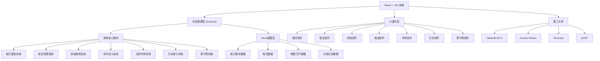

## 1. 架构设计



## 2. 技术说明
- **前端**：React@18 + TypeScript + Vite@5
- **样式**：TailwindCSS@3 + 自定义航海主题
- **状态管理**：Zustand（轻量级，适合游戏状态）
- **动画**：Framer Motion（交互动画）+ CSS动画（天气/波浪）
- **图表**：Recharts（收益统计、士气变化）
- **PDF导出**：jsPDF + html2canvas
- **后端**：无后端，使用Mock数据模拟多人在线
- **数据持久化**：localStorage 保存玩家进度
- **初始化工具**：vite-init

## 3. 路由定义
| 路由 | 用途 |
|------|------|
| / | 首页/主控制台，快速入口和概览 |
| /shipyard | 船坞 - 建造和改装船只 |
| /crew | 船员 - 招募和管理船员 |
| /voyage | 航海 - 出海探索和航线选择 |
| /battle | 海战 - 实时战斗界面（路由传参：战斗ID） |
| /market | 交易市场 - 图纸和船员合同交易 |
| /logbook | 航海日志 - 统计报告和PDF导出 |
| /leaderboard | 排行榜 - 全服排名展示 |

## 4. 核心数据模型定义

```typescript
// 船体模块
interface ShipHull {
  id: string;
  name: string;
  tier: number;
  baseSpeed: number;
  baseDefense: number;
  maxCrew: number;
  maxCannons: number;
  cost: number;
  image: string;
}

// 火炮模块
interface ShipCannon {
  id: string;
  name: string;
  tier: number;
  damage: number;
  fireRate: number; // 冷却时间（秒）
  range: number;
  cost: number;
}

// 帆模块
interface ShipSail {
  id: string;
  name: string;
  tier: number;
  speedBonus: number;
  maneuverBonus: number;
  cost: number;
}

// 装甲模块
interface ShipArmor {
  id: string;
  name: string;
  tier: number;
  defenseBonus: number;
  speedPenalty: number;
  cost: number;
}

// 组装后的船只
interface Ship {
  id: string;
  name: string;
  hull: ShipHull;
  cannons: ShipCannon[];
  sail: ShipSail;
  armor: ShipArmor;
  speed: number; // 自动计算
  firepower: number; // 自动计算
  defense: number; // 自动计算
  maxHp: number;
  currentHp: number;
}

// 船员类型
type CrewRole = 'captain' | 'gunner' | 'sailor';

interface CrewMember {
  id: string;
  name: string;
  role: CrewRole;
  avatar: string;
  loyalty: number; // 0-100
  skills: {
    navigation?: number;
    gunnery?: number;
    sailing?: number;
    combat?: number;
    leadership?: number;
  };
  level: number;
  exp: number;
  contractPrice?: number; // 交易市场价格
}

// 天气类型
type WeatherType = 'clear' | 'cloudy' | 'rain' | 'storm' | 'fog';

interface Weather {
  type: WeatherType;
  windSpeed: number; // 节
  windDirection: number; // 角度
  visibility: number; // 0-100
}

// 航海事件
type EventType = 'treasure' | 'enemy' | 'storm' | 'kraken' | 'island' | 'merchant';

interface VoyageEvent {
  id: string;
  type: EventType;
  title: string;
  description: string;
  timestamp: number;
  resolved: boolean;
  reward?: {
    gold?: number;
    resources?: Record<string, number>;
    blueprints?: string[];
  };
  penalty?: {
    hpLoss?: number;
    crewLoss?: number;
    goldLoss?: number;
  };
}

// 海战状态
interface BattleState {
  id: string;
  playerShip: Ship;
  enemyShip: {
    id: string;
    name: string;
    hp: number;
    maxHp: number;
    firepower: number;
    defense: number;
    speed: number;
    crewCount: number;
  };
  playerCrew: CrewMember[];
  cannonCooldowns: number[]; // 每个火炮剩余冷却
  playerHeading: number; // 航向角度
  enemyHeading: number;
  distance: number; // 两船距离
  timeElapsed: number;
  status: 'fighting' | 'won' | 'lost' | 'boarding';
  casualties: {
    player: number;
    enemy: number;
  };
}

// 交易物品
type MarketItemType = 'blueprint' | 'crewContract';

interface MarketListing {
  id: string;
  sellerId: string;
  sellerName: string;
  type: MarketItemType;
  item: {
    blueprintId?: string;
    blueprintName?: string;
    crew?: CrewMember;
  };
  price: number;
  suggestedPriceMin: number;
  suggestedPriceMax: number;
  listedAt: number;
}

// 成交记录
interface TradeRecord {
  id: string;
  listingId: string;
  buyerName: string;
  sellerName: string;
  itemName: string;
  price: number;
  timestamp: number;
  triggeredBounty: boolean;
}

// 航海日志
interface WeeklyLog {
  weekStart: string;
  weekEnd: string;
  voyageCount: number;
  battleWins: number;
  battleLosses: number;
  totalGoldEarned: number;
  totalGoldSpent: number;
  routes: { location: string; visits: number }[];
  crewMoraleHistory: { date: string; morale: number }[];
  battleStats: {
    shipsSunk: number;
    cannonsFired: number;
    damageDealt: number;
    damageTaken: number;
    crewLost: number;
    crewRecruited: number;
  };
}

// 玩家数据
interface Player {
  id: string;
  name: string;
  avatar: string;
  gold: number;
  level: number;
  reputation: number;
  ships: Ship[];
  activeShipId: string;
  crew: CrewMember[];
  inventory: {
    blueprints: string[];
    resources: Record<string, number>;
  };
  stats: {
    totalWealth: number;
    totalBattles: number;
    shipsSunk: number;
    plunderCount: number;
  };
}
```

## 5. 状态管理切片

```typescript
// Zustand Store 结构
interface GameStore {
  // 玩家数据
  player: Player;
  setPlayer: (p: Player) => void;
  
  // 船只
  ships: Ship[];
  currentShip: Ship | null;
  selectShip: (id: string) => void;
  calculateShipStats: (config: ShipConfig) => ShipStats;
  
  // 船员
  crew: CrewMember[];
  recruitCrew: (member: CrewMember) => void;
  dismissCrew: (id: string) => void;
  updateLoyalty: (id: string, delta: number) => void;
  
  // 航海
  currentWeather: Weather;
  currentLocation: { x: number; y: number };
  voyageEvents: VoyageEvent[];
  updateWeather: () => void;
  startVoyage: () => VoyageEvent;
  
  // 战斗
  activeBattle: BattleState | null;
  startBattle: (enemyId: string) => void;
  fireCannon: (index: number) => void;
  changeHeading: (degrees: number) => void;
  initiateBoarding: () => void;
  endBattle: (victory: boolean) => BattleReward;
  
  // 市场
  marketListings: MarketListing[];
  tradeHistory: TradeRecord[];
  createListing: (item: MarketItem) => void;
  buyListing: (id: string) => void;
  getPriceSuggestion: (itemType: string, itemId: string) => { min: number; max: number; avg: number };
  
  // 日志
  weeklyLog: WeeklyLog;
  generateWeeklyLog: () => void;
  exportPDF: () => void;
  
  // 排行榜
  leaderboard: {
    wealth: PlayerRank[];
    power: PlayerRank[];
    plunder: PlayerRank[];
  };
}
```

## 6. Mock数据初始化

预置数据包括：
- 6种船体（小型快速帆船到大型战舰）
- 8种火炮（不同伤害/射速/射程）
- 5种帆配置
- 5种装甲类型
- 15名可招募船员（5船长/5炮手/5水手）
- 10个随机航海事件模板
- 5个AI敌人船只配置
- 20条历史交易记录（用于定价建议）
- 10名排行榜玩家数据
